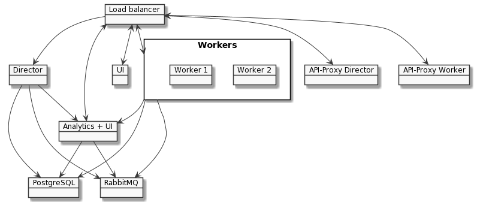
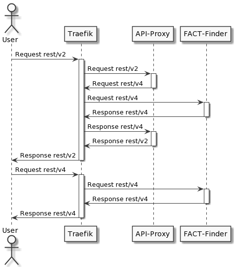

> :warning: This is an example to illustrate the configuration and communication of the various components
> in a complete FACT-Finder cluster setup. It is not intended for use in a productive environment in which
> we recommend using Docker Swarm or Kubernetes and distributing it to multiple servers.

## Setup example (Docker Compose)

### Prerequisites

Before you can follow this article, you need to have a system with an installed Docker and Docker Compose
environment. On top of that, you should have an account for the FACT-Finder Docker registry which you can
request from your contact person.

### Configuration

Once you satisfied the need for Docker, you should download and provide a preset of configuration files from
our GitHub project (https://github.com/FACT-Finder/ff-cluster-compose) in a directory of your choice. The directory structure should look like this:

```
ff-compose
├── analytics
│   └── production.conf
├── docker-compose.yml
├── .env
├── postgres
│   └── init.sql
├── rabbitmq
│   ├── rabbitmq.conf
│   └── rabbitmq.definitions
└── resources
```

The `resources` directory is just an empty directory which is not included in the package but has to be created
before continuing. Some of these files need a few adaptions from your side in order to work properly.

#### production.conf

The production.conf includes credentials for analytics and RabbitMQ which should be subject to change:

```
...

# Change the host when running analytics behind a reverse proxy. In this example, traefik serves analytics on localhost/analytics
swagger.api.host = "localhost/analytics"

play.http.secret.key = "mysecretkey"

...

op-rabbit {
  
  ...

  connection {

    ...
    
    username = "rabbitmquser"
    password = "rabbitmqsecurepassword"

    ...
  }
}
```

#### rabbitmq.conf

The rabbitmq.conf contains a user setting which has to be adapted to the configured user from production.conf:

```
loopback_users.rabbitmquser = false

...
```

#### rabbitmq.definitions

The rabbitmq.definitions has some settings which have to be adapted to the credentials from production.conf:

```
{
...

  "users": [
    {
      # User from production.conf
      "name": "rabbitmquser",
      # Password hash based on the configured algorithm and the password from production.conf.
      # See RabbitMQ documentation.
      "password_hash": "o55oKk9KodCLHvnC1+hmYQIQuJhhZdbYjJpUehUbHbzb4S5Y",
      "hashing_algorithm": "rabbit_password_hashing_sha256",
      "tags": "administrator"
    }
  ],

  ...

  "permissions": [
    {
      # User from production.conf
      "user": "rabbitmquser",

      ...
    }
  ],

...
}
```

#### .env

The .env file defines the docker registry and versions of images that are used inside the docker-compose configuration:

```
REGISTRY=<Docker image registry>
FF_VERSION=<FACT-Finder version of your choice>
ANALYTICS_TAG=<Analytics version of your choice>
```

### Docker Compose

Docker Compose is a tool for defining and running multi-container Docker applications. It uses a YAML file to configure
the application's services, and it needs only one single command to create and start all the services from the configuration.

The example Compose file creates a FACT-Finder environment that is made up of the following components:



The diagram shows the references of the different components in the cluster environment to each other. Please do not understand
it as a detailed description of the communication channels or the data flow in the system, e.g. the load balancer sends requests
to the API proxies and receives responses even if this is not shown here. Please have a look at the following paragraphs for
additional information about the components above.

#### Load balancer (Traefik)

In general, the load balancer's job is to receive incoming requests, distribute them to the different components and return
the response. Most of these requests are search requests for the workers, but it also serves the FACT-Finder- and Analytics-UI.
Since the requests may rely on old API versions, the load balancer can make use of the API proxy.

#### API proxy

The request and response format of the FACT-Finder REST-API slightly differs from version to version due to the needed changes
for additional features. This may be a problem since the shop using the FACT-Finder relies on a specific format. In order to
enable the shop to use a new version of the FACT-Finder without the need to change the integration, the API proxy can be used
in a FACT-Finder environment to translate requests and responses between different API versions. This is achieved via a load
balancer that sends every request with an older API version than the FACT-Finder's API version to the API proxy, receives the
translated request and sends it to the FACT-Finder afterwards. It works the same way with the response in the opposite direction.

##### Request flow

In this example setup, search requests will be routed as in the following diagram, depending on whether they belong to API version
`v2`, `v3` or `v4`.  Note that `v2` and `v3` requests pass the load balancer twice.



#### Director, UI and Workers

The FACT-Finder provides two different kinds of instances with a different set of jobs:

##### Director + UI

The director is a management instance in the example setup. It comes with a connection to the FACT-Finder UI in order to
configure the system, run imports and do research relating to the search quality. It is also possible to run delta updates for
the product data. However, the director does not respond to any search requests.

##### Workers

In comparison to the director, the workers have exactly one single job to fulfill - they respond to search related requests.
The workers are running with the same configuration as the director, and the setup can be scaled up to provide as many workers
as needed to respond to the incoming amount of search requests in a reasonable amount of time.

#### Analytics + UI

The Analytics software uses the data concerning the user interaction with the FACT-Finder to give insights into the user behaviour,
the success of the shop, suspected problems with the integration and potential for improvement.

#### RabbitMQ

The RabbitMQ is a message broker used by the FACT-Finder to realize live learning for features like A/B testing or personalization.
Please refer to the RabbitMQ documentation for further information.

#### PostgreSQL

The PostgreSQL database in the example setup stores the product data as well as the data coming from Analytics. Please refer to the
PostgreSQL documentation for further information.

#### Docker Compose file

[Here is a commented example docker-compose file](docker-compose.yml) to run a FACT-Finder environment like described above in this documentation. Please note
that an account for the FACT-Finder registry is needed to receive the docker images. Feel free to adapt the example to fit your needs.

### Environment URLs

Without any adaptions to the predefined URLs in the example Compose file, the different components are available at the following URLs:

|**Component**|**URL**|
|---|---|
|UI|http://localhost/fact-finder-ui|
|Director|http://localhost/director/fact-finder|
|Worker 1 + 2 (via load balancer)|http://localhost/worker/fact-finder|
|Worker 1 / 2 Swagger-UI|http://\<dynamicIP\>:8080/fact-finder|
|Analytics|http://localhost/analytics/|
|Analytics Swagger-UI|http://localhost/analytics/swagger-ui|
